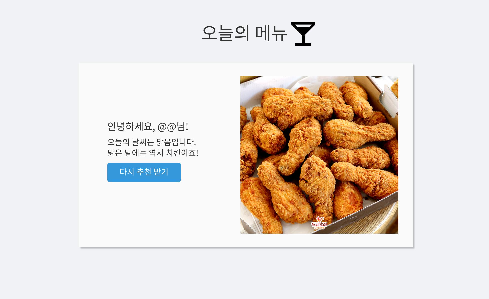

# 자바스크립트를 이용한 음식 추천 페이지

https://lea-hwang.github.io/today-menu.github.io/

## 1. 목표

* API 사용법 익히기
* HTML/CSS/JavaScript 이용한 정적페이지 구현
* github 호스팅
* 요구사항 정의, 분석 및 구현
* 목업 툴 이용한 UI 설계

## 2. 준비사항

- [날씨 api](https://openweathermap.org/)
- github repository

## 3. 요구사항

- 1차 : HTML/CSS/JS github 호스팅
  - 로그인 기능
  - 오늘 메뉴 추천받기(시간 띄우기) 버튼 구현
  - 날씨 API 사용해서 현재 날씨 정보 가져오기
    - 가져온 정보로 날씨 분류(rain/snow/clear/clouds) 
  - 날씨에 따른 메뉴 추천하기

### 3.1 날씨 분류

* https://openweathermap.org/weather-conditions
* ID 값을 사용하여 날씨를 구분합니다.
  * rain
    * Group 2xx: Thunderstorm
    * Group 3xx: Drizzle
    * Group 5xx: Rain
    * 771 : Squall
    * 781 : Tornado
  * snow
    * Group 6xx: Snow
  * clear
    * Group 800: Clear
  * clouds
    * Group 7xx: Atmosphere (except 771, 781)
    * Group 80x: Clouds

### 3.2 날씨에 따른 음식 추천

* WeatherAndFood.json

| 날씨   | 음식                                             |
| ------ | ------------------------------------------------ |
| rain   | 치킨, 파전, 어묵탕, 삼계탕, 쌀국수, 우동         |
| snow   | 치킨, 샤브샤브, 전골, 피자, 스테이크, 파스타,    |
| clear  | 치킨, 떡볶이, 순대, 초밥, 비빔밥, 차돌박이       |
| clouds | 치킨, 누룽지탕, 튀김, 칼국수, 수제비, 곱창, 막창 |

### 3.3 mockup

#### 첫 방문

#### 방문 경험 있는 경우(username 등록한 경우)

#### 추천 받기 버튼 누른 경우

## Todo

* 1.5: 만개의 레시피 링크 걸기
  - +a 해당 링크를 이용해서 크롤링 후 상세 레시피 페이지 보여주기
* 2차 : API 사용한 기능 추가
  - 음식 사진 띄우기
  - instagram API / 구글 이미지 검색 API / 네이버 이미지 검색 API

---

## 진행 상황

| 내용                                                         | 날짜              | 참석자                 | 확인 |
| ------------------------------------------------------------ | ----------------- | ---------------------- | ---- |
| 요구사항 명세서 작성 - 음식사진 모으기 - mockup 화면 만들기 - WeatherAndFood.json 작성 | 2022.04.17.일요일 | 홍동현, 이미현, 황희원 | ✅    |
| 명세서에 따른 페이지 구현                                    | 2022.04.23.토요일 |                        |      |
|                                                              |                   |                        |      |

